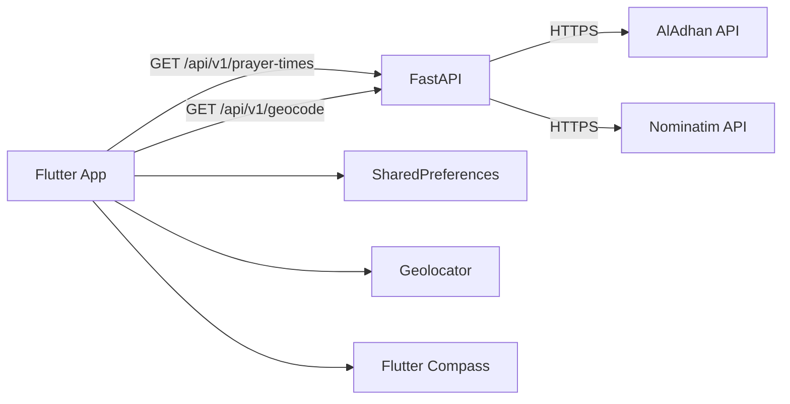

# 🧭 Prayer Compass

A location-aware prayer companion built with **Flutter + FastAPI**.

It gives you daily prayer times, a Qibla compass, and a world-map Qibla route in one app. The goal is simple: keep the UX clean while still exposing the details that matter for trust (`method`, `madhhab`, coordinates, timezone).

## ✨ Why This Exists

Prayer apps usually optimize for one side only:

- 🎨 Beautiful UI, weak transparency
- 🧠 Accurate logic, rough UX

Prayer Compass aims to bridge both:

- 🔍 Explicit calculation controls
- 🗺️ Visible location + timezone context
- 🛟 Resilient fallback behavior
- 🧾 Clear error states instead of silent failures

## 🚀 What You Get

- 📍 Live prayer times from your current location
- 🧷 Manual coordinate mode with persisted settings
- 🧮 Calculation method selector (`method` for AlAdhan)
- 🕌 Madhhab selector (`Shafi` / `Hanafi`, affects Asr)
- ⏳ Next-prayer highlighting and live countdown
- 🧭 Qibla compass using device heading + computed bearing
- 🌍 Qibla line map with geodesic route to the Kaaba
- 🗺️ Open-in-Google-Maps with robust Android/web fallback
- 🔌 Backend endpoints for prayer times, geocoding, and health

## 🛣️ Roadmap


### 🚧 Building Now

- 🧪 Improve diagnostic UX for location/timezone mismatches
- 🧭 Refine Qibla map readability on small devices
- 🌐 Better fallback behavior when external maps cannot open

### ⏭️ Coming Up Next

- 🔔 Local prayer notifications with per-prayer toggles
- 🗺️ Country/city presets for quicker setup
- 🌍 Better localization polish (German/English flow consistency)

### 🌌 Future Vision

- 🧠 Smarter method recommendations by region
- 🏙️ Nearby mosque discovery mode
- 📶 Offline cache for last successful timetable
- ⌚ Companion integration concepts (wearables/widgets)

> Note: roadmap items are planned targets and can be reprioritized.

## ⚡ One-Minute Tour

When you press **Aktualisieren**, this is the request path:

1. 📱 Frontend resolves coordinates (live GPS or manual saved values).
2. 🖥️ Backend receives `/api/v1/prayer-times?lat=...&lon=...`.
3. 🌐 Backend calls AlAdhan and normalizes the response.
4. 🧩 Frontend renders times, countdown, location chip, and timezone chip.
5. 🕋 Qibla widgets use the same active coordinates for bearing, route, and deep link.

## 🧰 Tech Stack

### 📱 Frontend

- Flutter (Material)
- `ChangeNotifier` controller layer
- `dio` for API calls
- `geolocator` for device position
- `geocoding` for reverse labels
- `flutter_compass` for heading
- `flutter_map` + OpenStreetMap tiles for in-app route view
- `shared_preferences` for local settings
- `url_launcher` for external maps

### 🖥️ Backend

- FastAPI
- `httpx` upstream client
- `pydantic` schemas
- AlAdhan Timings API (`/v1/timings`)
- Nominatim geocoding (`openstreetmap.org`)

## 🧱 Architecture



## 🗂️ Project Layout

```text
prayer-times-app/
  backend/
    app/
      api/v1/routes/
        prayer_times.py
        geocode.py
      services/
        aladhan_client.py
        geocode_client.py
      schemas/
        prayer_times.py
        geocode.py
      main.py
    requirements.txt
    run_backend.ps1

  frontend/
    lib/
      src/
        controllers/
          prayer_times_controller.dart
        services/
          prayer_api_client.dart
          location_service.dart
          settings_store.dart
        ui/
          prayer_home_page.dart
          qibla_map_page.dart
          widgets/qibla_compass_card.dart
        utils/
          qibla_utils.dart
          prayer_time_utils.dart
    android/app/src/main/AndroidManifest.xml
    pubspec.yaml
```

## 🌐 API Endpoints

Base URL (local): `http://127.0.0.1:8000`

### `GET /health`

Returns backend status.

```bash
curl http://127.0.0.1:8000/health
```

```json
{"status":"ok"}
```

### `GET /api/v1/prayer-times`

Query params:

- `lat` (required, float)
- `lon` (required, float)
- `method` (optional, default `2`)
- `school` (optional, default `0`; `0=Shafi`, `1=Hanafi`)

```bash
curl "http://127.0.0.1:8000/api/v1/prayer-times?lat=52.5174&lon=13.3951&method=13&school=1"
```

```json
{
  "date": "11 Feb 2026",
  "timezone": "Europe/Berlin",
  "location": {"lat": 52.5173885, "lon": 13.3951309},
  "method": 13,
  "school": 1,
  "times": {
    "Fajr": "05:35",
    "Sunrise": "07:24",
    "Dhuhr": "12:26",
    "Asr": "15:23",
    "Maghrib": "17:19",
    "Isha": "19:01"
  }
}
```

### `GET /api/v1/geocode`

Text lookup endpoint for city/district/address to coordinates.

Query params:

- `q` (required, min length `2`)

```bash
curl "http://127.0.0.1:8000/api/v1/geocode?q=Berlin"
```

```json
{
  "query": "Berlin",
  "label": "Berlin, Deutschland",
  "location": {"lat": 52.5173885, "lon": 13.3951309}
}
```

## 🕋 Qibla Implementation Notes

Kaaba reference used by the app:

- latitude: `21.422487`
- longitude: `39.826206`

The app computes:

- 🧭 **bearing** from user coordinates to Kaaba
- 📏 **great-circle distance** (haversine)
- 🧵 **geodesic path** (interpolated points for map polyline)

The map renderer splits route segments at dateline jumps so long-distance lines stay visually stable.

## 📍 Location Behavior (Important)

The app supports two modes:

- **Live location** (GPS / device services)
- **Manual location** (saved coordinates + label)

There is also a mismatch repair guard:

- If manual label is city-like (for example `Berlin`)
- But saved coordinates are still fallback defaults
- App calls `/api/v1/geocode` and updates manual coordinates automatically

This prevents the "Berlin label but America/New_York timezone" inconsistency.

## 🗺️ Google Maps Launch Behavior

On some devices/emulators, URL intents fail depending on package visibility or browser availability.

Current behavior:

- tries multiple launch modes (`platformDefault`, `externalApplication`, `inAppBrowserView`)
- if all fail, copies the maps URL to clipboard
- shows a snackbar explaining fallback

Android manifest includes `queries` for `https` and `geo` schemes to improve Android 11+ compatibility.

## ✅ Requirements

- Flutter SDK compatible with Dart `>=3.2.3 <4.0.0`
- Python `3.9+`
- Android emulator or physical device (recommended for location/compass tests)

## 🧪 Local Setup

### 1) 🖥️ Backend

```bash
cd backend
python3 -m venv .venv
source .venv/bin/activate
pip install -r requirements.txt
uvicorn app.main:app --host 0.0.0.0 --port 8000 --reload
```

Windows PowerShell helper:

```powershell
cd backend
.\run_backend.ps1
```

Health check:

```bash
curl http://127.0.0.1:8000/health
```

Open API docs:

- `http://127.0.0.1:8000/docs`
- `http://127.0.0.1:8000/openapi.json`

### 2) 📱 Frontend

```bash
cd frontend
flutter pub get
```

Run on Android emulator:

```bash
flutter run -d emulator-5554 --dart-define=API_BASE_URL=http://10.0.2.2:8000
```

Run on iOS simulator:

```bash
flutter run -d ios --dart-define=API_BASE_URL=http://127.0.0.1:8000
```

Run on web (Chrome):

```bash
flutter run -d chrome --dart-define=API_BASE_URL=http://127.0.0.1:8000
```

## ⚙️ Runtime Config

`API_BASE_URL` is provided via `--dart-define`.

Defaults in app code:

- Android: `http://10.0.2.2:8000`
- Web/others: `http://127.0.0.1:8000`

## 🛠️ Useful Dev Commands

Frontend:

```bash
cd frontend
flutter test
flutter analyze
```

Backend quick syntax check:

```bash
python3 -m py_compile backend/app/main.py
python3 -m py_compile backend/app/services/aladhan_client.py
python3 -m py_compile backend/app/services/geocode_client.py
```

## 🆘 Troubleshooting

### 🌎 Timezone shows `America/New_York` unexpectedly

Usually means the request was sent with fallback coordinates (`40.7128,-74.0060`).

Try this:

- 📌 Switch to manual mode and set correct coordinates explicitly
- 🏷️ Keep manual label (`Berlin`) and refresh to trigger geocode repair
- 📜 Verify backend logs show expected `lat/lon`

### 🗺️ Google Maps does not open

- 🌐 Ensure emulator/device has a browser or maps handler
- 🔁 Retry from Qibla card or Qibla map action
- 📋 If still blocked, use the copied URL from clipboard fallback

### 📡 Backend unreachable from Android emulator

Use `10.0.2.2`, not `localhost`.

### 🚪 Port `8000` already in use

```bash
lsof -nP -iTCP:8000 -sTCP:LISTEN
kill <PID>
```

### 🧭 Compass data unavailable

- 🤖 Emulators often have no reliable compass stream
- 📱 Test on a physical device
- ♾️ Move phone in a figure-8 pattern for sensor calibration

## 🔒 Notes for Production Hardening

- 🔐 Restrict CORS origin list
- 🚦 Add API rate limiting and caching
- 📊 Add structured logging + metrics
- 🔁 Add retry/backoff policy for upstream failures
- ✅ Add integration tests for endpoint contracts

## 📜 License

MIT. See `LICENSE`.
