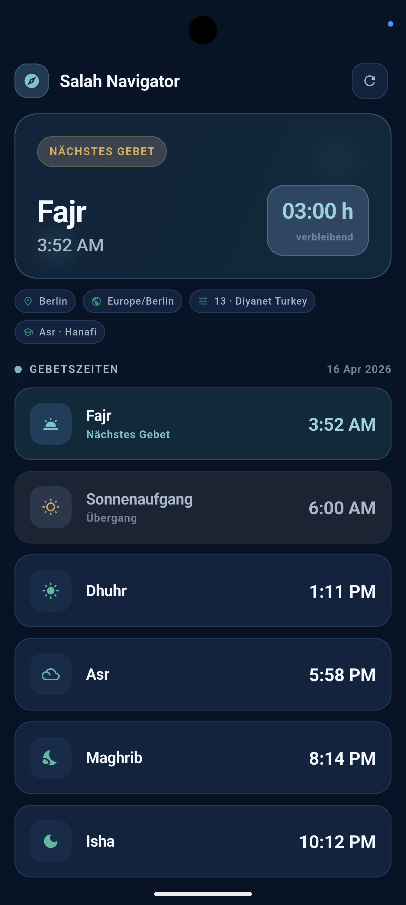
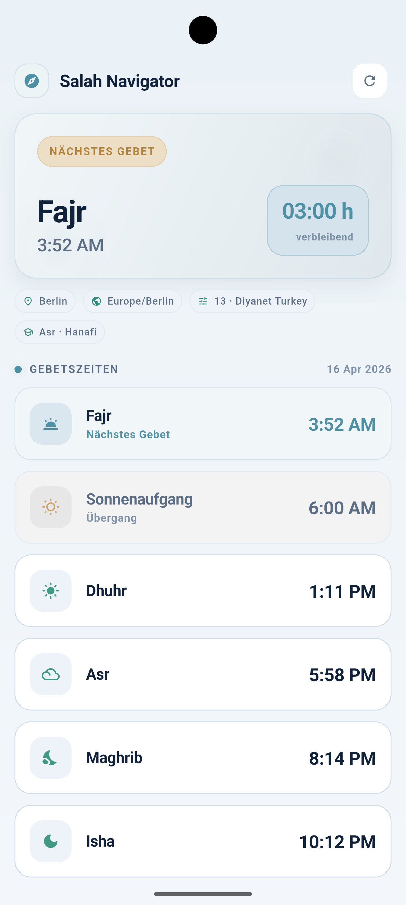
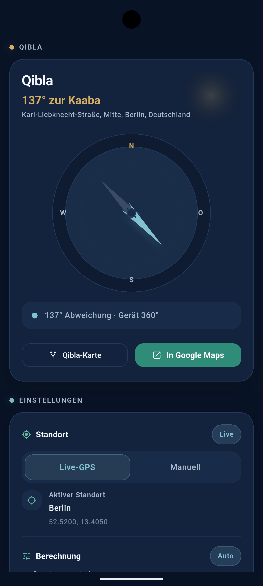
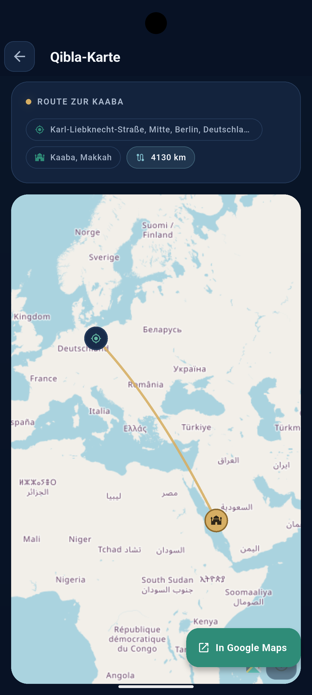
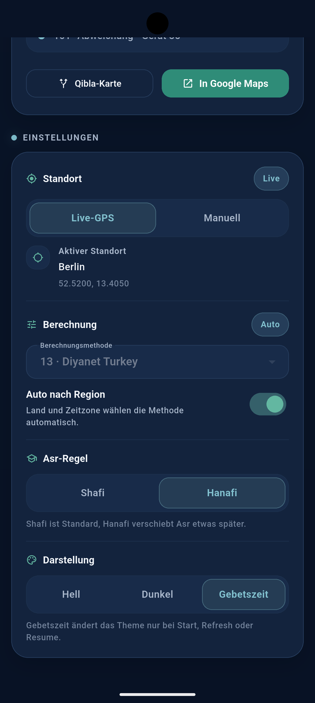
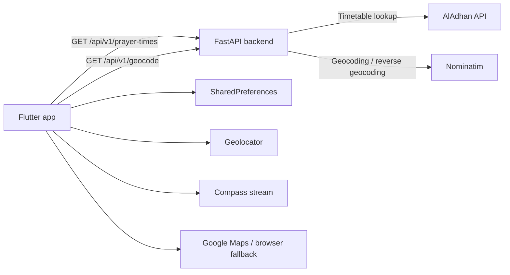

# Salah Navigator

A location-aware prayer companion built with Flutter and FastAPI.

Salah Navigator combines daily prayer times, next-prayer focus, Qibla orientation, and transparent calculation controls in one calm mobile experience. The project is designed around a simple product principle: users should be able to trust what the app shows, why it shows it, and which context the result is based on.

## Visual Preview



*Current home screen preview with next-prayer emphasis, contextual location metadata, daily timetable, and Qibla access. Some UI labels in the current build are still localized in German.*

## What Salah Navigator Is

Salah Navigator is a mobile prayer companion for users who want more than a decorative prayer times screen. It brings together:

- location-aware daily prayer times
- explicit calculation method and school handling
- a next-prayer hero with live countdown
- a Qibla compass driven by device heading and computed bearing
- a geodesic Qibla route map to the Kaaba
- visible context such as location, timezone, coordinates, method, and school

The project is intentionally positioned between product design and engineering rigor. It is not only about showing prayer times; it is about showing them in a way that feels clear, precise, trustworthy, and understandable.

## Why This Project Exists

Many prayer apps optimize for one side of the experience but not the whole system.

- Some look polished, but hide the calculation context that determines the result.
- Others expose technical controls, but feel rough, overloaded, or difficult to trust at a glance.

Salah Navigator exists to bridge that gap.

The project treats prayer times and Qibla not as generic dashboard data, but as trust-sensitive information. Location, timezone, calculation method, and Asr rule materially affect what the user sees. Making those dependencies visible is part of the product value, not a developer-only detail.

## Key Features

### Daily prayer times

- Fetches a daily timetable for the active coordinates through a FastAPI backend.
- Displays the canonical prayer sequence, including sunrise as a contextual transition point.
- Keeps the timetable visible alongside its calculation basis.

### Next prayer and live countdown

- Highlights the next upcoming prayer in a dedicated hero area.
- Shows the prayer name, exact time, and remaining time.
- Uses a stable visual system with subtle phase-based accents instead of aggressive theme hopping.

### Location-aware calculation

- Supports live GPS/device location.
- Surfaces resolved location context and timezone in the UI.
- Uses backend reverse geocoding to attach a readable location label to the active coordinates.

### Manual location mode

- Allows manual coordinates and an optional label.
- Persists manual coordinates locally.
- Includes a repair path for cases where a city-like manual label exists but stored coordinates are still fallback defaults.

### Calculation controls

- Supports AlAdhan calculation methods.
- Includes an auto-by-region mode in the app settings.
- Lets the user explicitly override the method when needed.

### Madhhab / Asr handling

- Supports `Shafi` and `Hanafi`.
- Treats school selection as a visible setting rather than a hidden assumption.

### Qibla compass

- Computes the Qibla bearing to the Kaaba from the active coordinates.
- Uses device heading data from the compass stream when available.
- Communicates alignment state as a focused guidance module instead of a technical dashboard.

### Qibla map and route view

- Renders a geodesic route toward the Kaaba using Flutter Map and OpenStreetMap tiles.
- Splits long-distance polylines at dateline jumps for visual stability.
- Offers an external Google Maps handoff as a practical fallback.

### Resilient fallback behavior

- Handles backend timeouts and network failures with explicit UI feedback.
- Falls back to clipboard copy when Google Maps cannot be opened.
- Keeps reverse geocoding best-effort so prayer times can still load even if location labels fail.

### Appearance modes

- Supports Light, Dark, and prayer-based appearance modes.
- Prayer-based mode follows the currently resolved prayer phase when the app recomputes state, for example on app start, manual refresh, or resume.

## For Non-Technical Stakeholders

This project is meaningful even if you never read the code.

At a product level, Salah Navigator serves a trust-sensitive daily need. A prayer companion is not just a schedule viewer. Users rely on it for time, direction, and religious context. If the app silently uses the wrong location, timezone, or calculation method, the problem is not cosmetic; it directly affects whether the output feels reliable.

That is why the app emphasizes visible context:

- where the schedule comes from
- which location is active
- which timezone is applied
- which method and school shape the timetable

This also makes the project a strong UX case study. It shows how a product can stay calm and visually refined while still exposing the logic behind the result. Instead of hiding complexity, it organizes it so users can understand it without feeling overwhelmed.

From a portfolio perspective, the project is notable because it combines:

- mobile UI design
- product thinking
- location-aware behavior
- sensor integration
- mapping
- backend orchestration
- error handling and fallback design

In short, Salah Navigator is not only an engineering exercise. It is a practical example of how to design trust into a real user workflow.

## User Experience and Design Principles

The UX philosophy behind the project is deliberately restrained.

- Trust through visible context: important calculation dependencies are surfaced instead of buried.
- Clarity over decoration: the screen prioritizes next prayer, exact time, and context before secondary details.
- Calm interaction design: the interface uses stable visual structure with subtle prayer-phase accents rather than dramatic full-theme shifts.
- Resilient fallbacks: unavailable maps, missing compass data, denied location permissions, and backend failures are handled explicitly.
- Product hierarchy first: key user questions are answered early, especially on the home screen.



*Light appearance mode preview. The app keeps the same hierarchy and structure while adapting surfaces, accents, and contrast for brighter environments.*

## Screens and Walkthrough

### Home and prayer times

The home screen is designed to answer three questions immediately:

1. What is the next prayer?
2. When exactly is it?
3. Which location and calculation context is this based on?

The hero block, trust strip, prayer list, and Qibla entry are arranged to keep the screen practical rather than ornamental. The home preview is shown near the top of this README.

### Qibla compass

The Qibla card is treated as an orientation module, not a sensor dashboard. The primary focus is the direction toward the Kaaba, followed by alignment quality and action options.



*Qibla compass screen with directional emphasis, alignment status, and direct access to map-based guidance.*

### Qibla route map

The route view gives users a spatial understanding of the direction instead of only a compass bearing. This is especially useful when users want to verify direction context visually or continue into an external maps app.



*In-app Qibla map showing the geodesic route to the Kaaba, with an external Google Maps fallback.*

### Settings and transparency controls

The settings area groups the most important decision points without turning into a developer panel. Users can switch between live and manual location, choose a calculation method, toggle region-aware recommendations, select the Asr rule, and choose the appearance mode.



*Settings surface for location mode, calculation method, school, and appearance mode.*

## Technical Architecture

### Stack

- Frontend: Flutter
- Backend: FastAPI
- Upstream prayer data: AlAdhan Timings API
- Upstream geocoding: Nominatim / OpenStreetMap
- Local storage: SharedPreferences
- Mapping: Flutter Map + OpenStreetMap tiles
- Device capabilities: location, compass, external map launches

### Frontend architecture

The active Flutter app lives primarily under `frontend/lib/src`.

- `PrayerTimesController` orchestrates loading, refreshing, location resolution, prayer-phase resolution, next-prayer state, and settings persistence.
- `PrayerApiClient` isolates HTTP communication with the backend.
- `SettingsStore` persists method, school, appearance mode, location mode, and manual coordinates.
- Reusable UI widgets handle the home hero, chips, prayer rows, section headers, Qibla card, and map page.
- A custom theme and token system supports Dark, Light, and prayer-based appearance behavior.

### Backend architecture

The backend acts as a stable boundary between the app and external providers.

- `/api/v1/prayer-times` fetches timetable data from AlAdhan and enriches the response with best-effort reverse geocoding.
- `/api/v1/geocode` resolves user-entered place text to coordinates.
- Pydantic schemas define the response contracts.
- CORS is open in local development to simplify testing from mobile and web clients.

### Data flow


```mermaid
flowchart LR
  A["Flutter app"] -->|"GET /api/v1/prayer-times"| B["FastAPI backend"]
  A -->|"GET /api/v1/geocode"| B
  B -->|"Timetable lookup"| C["AlAdhan API"]
  B -->|"Geocoding / reverse geocoding"| D["Nominatim"]
  A --> E["SharedPreferences"]
  A --> F["Geolocator"]
  A --> G["Compass stream"]
  A --> H["Google Maps / browser fallback"]
```

## Repository Structure

```text
prayer-times-app/
  backend/
    app/
      api/v1/routes/        # FastAPI endpoints
      schemas/              # Pydantic response models
      services/             # Upstream clients and geocoding logic
      main.py               # FastAPI app entrypoint
    requirements.txt

  frontend/
    lib/
      core/                 # App config and theme
      src/
        controllers/        # ChangeNotifier controller layer
        core/               # Tokens, prayer phase logic, constants
        models/             # App and API data models
        services/           # API, settings, and location services
        ui/                 # Screens and reusable widgets
        utils/              # Prayer and Qibla utilities
    pubspec.yaml

  screenshots/             # README image assets
  README.md
```

## API Overview

Base URL in local development: `http://127.0.0.1:8000`

| Endpoint | Method | Purpose |
| --- | --- | --- |
| `/health` | `GET` | Simple backend health check |
| `/api/v1/prayer-times` | `GET` | Returns prayer times for coordinates, method, and school |
| `/api/v1/geocode` | `GET` | Resolves place text to coordinates |

### `GET /health`

```bash
curl http://127.0.0.1:8000/health
```

```json
{
  "status": "ok"
}
```

### `GET /api/v1/prayer-times`

Query parameters:

- `lat` - required latitude
- `lon` - required longitude
- `method` - optional AlAdhan calculation method, default `2`
- `school` - optional school flag, default `0` where `0 = Shafi`, `1 = Hanafi`

Example request:

```bash
curl "http://127.0.0.1:8000/api/v1/prayer-times?lat=52.5174&lon=13.3951&method=13&school=0"
```

Example response:

```json
{
  "date": "16 Apr 2026",
  "timezone": "Europe/Berlin",
  "location": {
    "lat": 52.5173885,
    "lon": 13.3951309,
    "label": "Berlin, Deutschland",
    "city": "Berlin",
    "country": "Germany"
  },
  "method": 13,
  "school": 0,
  "times": {
    "Fajr": "04:32",
    "Sunrise": "06:12",
    "Dhuhr": "13:04",
    "Asr": "16:48",
    "Maghrib": "20:03",
    "Isha": "21:36"
  }
}
```

### `GET /api/v1/geocode`

Query parameters:

- `q` - required text query, minimum length `2`

Example request:

```bash
curl "http://127.0.0.1:8000/api/v1/geocode?q=Berlin"
```

Example response:

```json
{
  "query": "Berlin",
  "label": "Berlin, Deutschland",
  "location": {
    "lat": 52.5173885,
    "lon": 13.3951309
  }
}
```

## Configuration and Runtime Behavior

### API base URL

The Flutter app accepts `API_BASE_URL` through `--dart-define`.

If no explicit value is supplied, the current code falls back to:

| Platform | Default base URL |
| --- | --- |
| Android emulator | `http://10.0.2.2:8000` |
| iOS simulator / macOS / web / other local targets | `http://127.0.0.1:8000` |

### Location behavior

- Live mode uses device location with high accuracy.
- Manual mode stores coordinates and a label locally.
- The backend attempts reverse geocoding so the UI can show a readable place label.
- If a manual label looks valid but stored coordinates are still fallback defaults, the app can repair that state through `/api/v1/geocode`.

### Timezone behavior

- The backend returns timezone metadata from the prayer data provider.
- The frontend surfaces timezone as part of the trust context strip.
- A wrong timezone is usually a sign that the active coordinates are wrong.

### Maps fallback behavior

- The app tries multiple launch modes for Google Maps.
- If no launch succeeds, it copies the route URL to the clipboard and shows a snackbar message.

### Theme behavior

- `Light` keeps a bright, high-contrast version of the same core hierarchy.
- `Dark` uses the calmer navy/slate palette.
- `Prayer-based` follows the currently resolved prayer phase when the app recomputes state, such as on app start, refresh, or resume.
- The app does not aggressively re-theme on every countdown tick.

## Local Development Setup

### Prerequisites

- Flutter SDK compatible with Dart `>=3.2.3 <4.0.0`
- Python `3.9+`
- A simulator, emulator, browser, or physical device for frontend testing

### 1. Backend setup

```bash
cd backend
python3 -m venv .venv
source .venv/bin/activate
pip install -r requirements.txt
uvicorn app.main:app --host 0.0.0.0 --port 8000 --reload
```

Windows PowerShell helper:

```powershell
cd backend
.\run_backend.ps1
```

Useful backend checks:

```bash
curl http://127.0.0.1:8000/health
```

Then open `http://127.0.0.1:8000/docs` in your browser for the interactive API docs.

### 2. Frontend setup

```bash
cd frontend
flutter pub get
```

Run on Android emulator:

```bash
flutter run --dart-define=API_BASE_URL=http://10.0.2.2:8000
```

Run on iOS simulator or macOS:

```bash
flutter run --dart-define=API_BASE_URL=http://127.0.0.1:8000
```

Run on Chrome:

```bash
flutter run -d chrome --dart-define=API_BASE_URL=http://127.0.0.1:8000
```

### Useful development commands

Frontend:

```bash
cd frontend
flutter analyze
flutter test
```

Backend quick verification:

```bash
python3 -m compileall backend/app
```

## Troubleshooting

### The app shows `Mountain View`, `California`, or `America/Los_Angeles`

This usually means the runtime target is reporting the default emulator or simulator location, not your real location.

- Android Emulator: open `Extended Controls` -> `Location` and send the correct coordinates.
- iOS Simulator: use `Features` -> `Location` -> `Custom Location...`.
- Chrome: verify browser location permissions and make sure DevTools sensors are not overriding location.

### The timezone looks wrong

Timezone mismatches usually trace back to incorrect coordinates.

- Check whether the app is in live or manual mode.
- Verify the active coordinates in the settings area.
- If needed, switch to manual mode and enter coordinates explicitly.

### Prayer times look off

The most common causes are the active calculation method or Asr rule.

- Check the selected calculation method.
- Check whether `Auto by region` is enabled.
- Verify whether the app is using `Shafi` or `Hanafi`.

### Google Maps does not open

- Ensure the device has a browser or maps handler available.
- Retry from the Qibla card or Qibla map page.
- If launch still fails, use the copied URL from the clipboard fallback.

### Backend is unreachable from Android emulator

Use `10.0.2.2`, not `localhost`.

### Port `8000` is already in use

```bash
lsof -nP -iTCP:8000 -sTCP:LISTEN
kill <PID>
```

### Compass data is unavailable

- Emulators typically do not provide a reliable compass stream.
- Test on a physical device when validating Qibla behavior.
- Recalibrate the device by moving it in a figure-eight pattern.

## Production Hardening and Future Improvements

If this project were pushed toward production maturity, the next practical steps would include:

- tightening CORS instead of allowing all origins
- adding response caching and upstream rate protection
- introducing structured logging and metrics
- adding richer automated integration tests around endpoint contracts
- improving offline behavior for the last successful timetable
- hardening notification and reminder flows if local prayer alerts are added
- expanding localization coverage and product copy consistency

## Roadmap

### In progress

- Improve diagnostic UX for location and timezone mismatches
- Refine Qibla map readability on small devices
- Improve fallback behavior when external maps cannot open

### Next up

- Local prayer notifications with per-prayer toggles
- Country and city presets for faster setup
- Further localization polish across German and English flows

### Future ideas

- Expand region-aware calculation recommendations
- Explore nearby mosque discovery concepts
- Add offline cache for the last successful timetable
- Investigate widgets, wearables, or companion integrations

Roadmap items are directional and can be reprioritized.

## License

MIT. See [LICENSE](./LICENSE).
